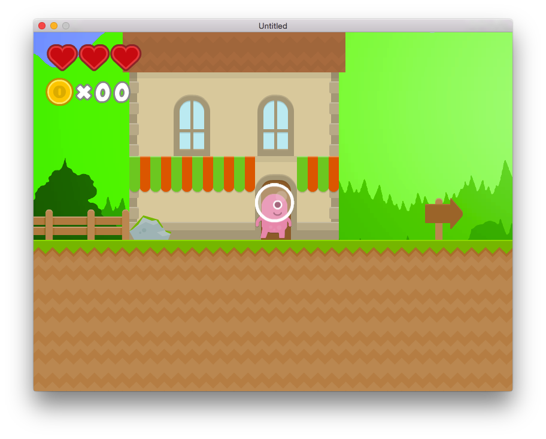

# PopJumper
A 2D platformer game powered by LÖVE2d game engine

##screenshot

##Feature
* A mario-like 2D platformer game
* Developed with the awesome light-weight 2D game engine -- LÖVE2d
* With inertia system
* There's only one level by now
* Frog has 10% probability to trigger bug

## License
PopJumper is licensed under the MIT license.
